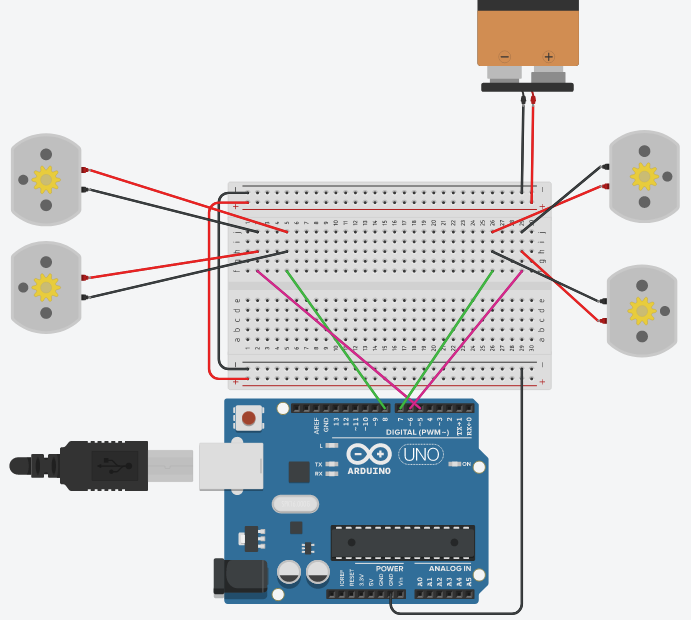

# Voiture Arduino

## Description

Ce projet est issu de la matière "IoT" de la Licence Professionnelle Mobile à L'IUT de Clermont-Ferrand.

L'objectif est de contrôler,à l'aide de son téléphone, une mini-voiture électrique disposant de 4 moteurs : un par roue.

## Branches GIT
  
La version du fichier .ino sur la branche "main" contient de nombreuses fonctions inutilisées concernant une LED RGB et un bouton poussoir ainsi que des lignes commentées issues de divers tests. La branche "main" contient également une copie du Sample fourni par Mr.Kévin BEAUGRAND.

Il existe donc une version simplifiée du projet dans la branche "test_simplification", où le sample ainsi que le surplus de code a été enlevé.  
:warning: Ce code n'a pas été testé et bien qu'il soit censé fonctionner, ce n'est peut-être pas le cas ! :warning: 

## Équipement, Appareils & Librairies

Le projet a été conçu avec les équipements et appareils suivants :
- 1 Carte Arduino Uno,
- 1 Shield ESP8266 monté sur la carte Arduino,
- 1 module SBC-MotoDriver2,
- 1 pack de 4 piles AA (sortie 12V),
- 1 Kit voiture 4WD avec moteurs à courant continu,
- Des câbles Arduino, 
- 1 téléphone Android.

Le projet utilise une librairie conçue par Mr.Kévin BEAUGRAND, ainsi que d'autres librairies communes. Elles se situent toutes dans le dossier "Libraries" et sont nécessaires au bon fonctionnement de la solution.

## Montage & Schéma

Voici un schéma représentant le montage de notre solution :

:warning: Ce schéma ne représente pas le montage obtenu sur la voiture, mais plutôt une solution afin de gérer correctement les moteurs à l'aide du fichier Arduino. Le Shield ESP8266 ainsi que le module SBC n'étant pas disponibles sur le site utilisé pour le schéma (TINKERCAD), nous avons dû nous adapter. :warning:

## Application

Afin d'utiliser la carte Arduino : 
- Ouvrez le fichier .ino dans le dossier "tp_voiture",
- Ajoutez les librairies au projet (si nécessaire),
- Configurez les variables WIFI_SSID et WIFI_PWD pour qu'elles correspondent au réseau Wi-Fi que vous souhaitez utiliser (a fonctionné avec un téléphone en point d'accès mobile),
- Transférez le programme,
- Effectuez un Reset de la carte.

Afin d'utiliser l'application mobile :
- Connectez votre téléphone Android au réseau Wi-Fi que vous souhaitez utiliser,
- Ouvrez le projet dans le dossier "app" avec Android Studio,
- Lancer le projet sur votre téléphone (un émulateur ne pourra pas communiquer avec la voiture),
Une fois l'application démarrée, entrez l'adresse ip de la carte Arduino (visible chez l'hôte) et le port 8080, puis appuyez sur le bouton "Connecter". 

Vous pouvez maintenant contrôler la voiture avec votre smartphone. 

## Auteurs
Emma GUILBAULT
Yannis BATTACHE
Clément FERRERE
